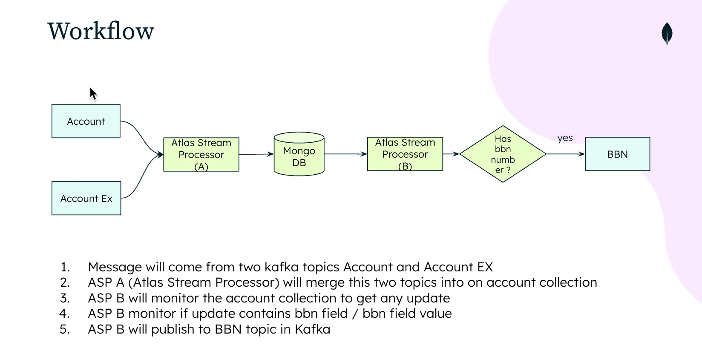

# Atlas Stream Processing POC 

#### Scenario Testing 

1. Message will come from two kafka topics Account and Account EX 
ASP A (Atlas Stream Processor) will merge 2. this two topics into on account collection 
3. ASP B will monitor the account collection to get any update 
4. ASP B monitor if update contains bbn field / bbn field value 
5. ASP B will publish to BBN topic in Kafka 
